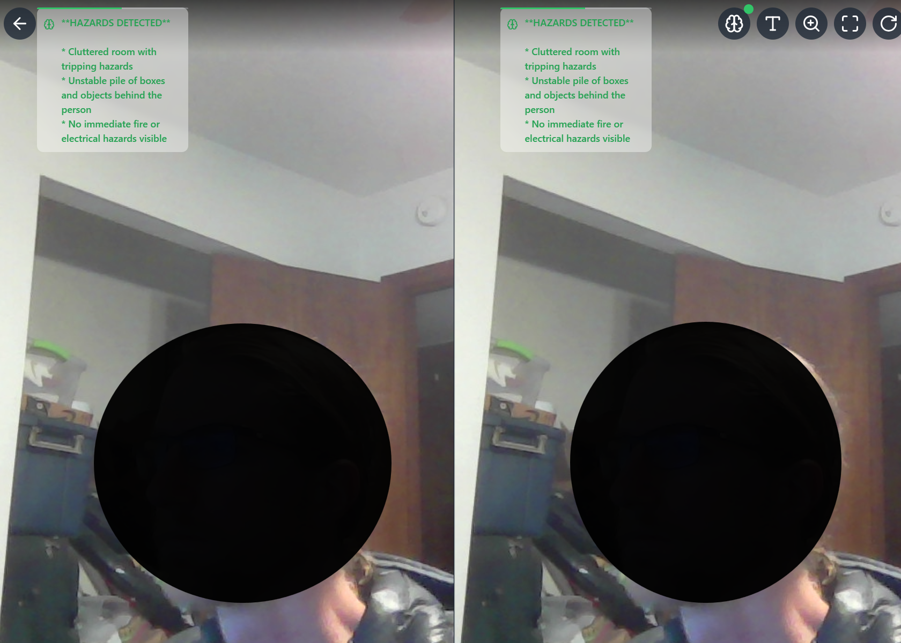
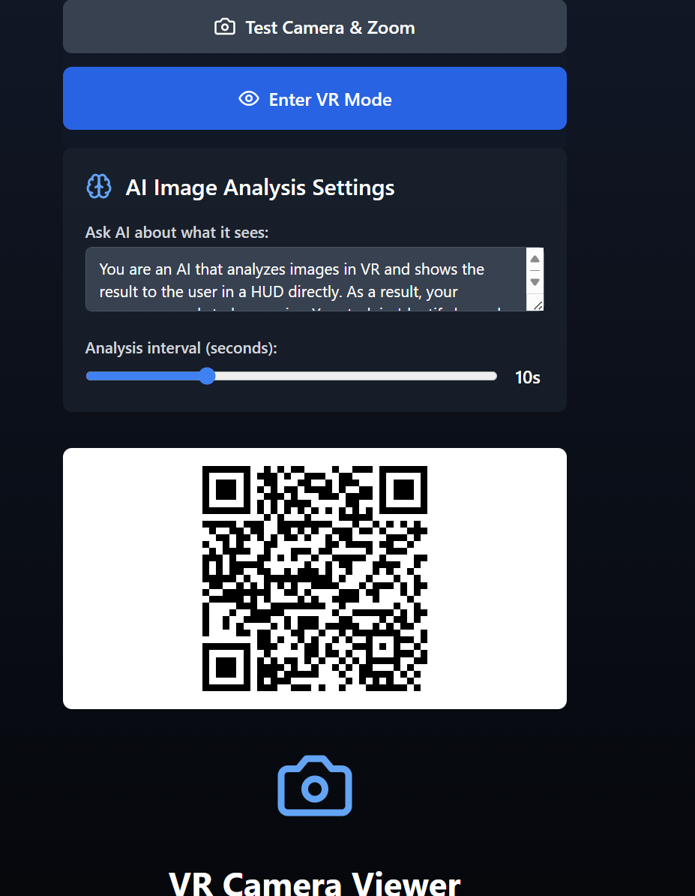

# 🥽 VR Camera Viewer 📱

## 👁️ See The World In Split Screen VR! 👁️

Experience your surroundings in virtual reality with this simple web application! Place your phone in a cardboard VR headset after starting and explore the world around you in stereoscopic 3D.

### ✨ Features

- 📱 Real-time camera feed in VR split-screen mode
- 🧠 AI-powered scene analysis (tells you what it sees!)
- 🔍 Camera zoom controls
- 🔄 Camera rotation for perfect alignment
- 📏 Adjustable text size for comfortable viewing

### 🚀 Getting Started

1. Clone this repo and run `npm install`
2. Create a `.env` file with your GROQ API key (for AI analysis)
3. Run `npm run dev` to start the development server
4. Scan the QR code with your mobile device
5. Grant camera and orientation permissions
6. Tap "Enter VR Mode" and place your phone in a VR headset

### 🛠️ How It Works

This application uses your device's camera and orientation sensors to create a stereoscopic 3D view. The image from your camera is split into two views (one for each eye), creating the illusion of depth when viewed through a VR headset.

The AI analysis feature can periodically scan what your camera sees and provide descriptions - perfect for accessibility or just having a virtual companion describe your surroundings!

### 🔮 Tech Stack

- React + TypeScript
- Vite for blazing fast development
- TailwindCSS for styling
- Groq AI API for image analysis
- Express backend for API proxying

### 📝 Note

Best experienced on mobile devices with:
- Recent browser versions (Chrome/Safari)
- Device orientation sensors
- Camera access
- A Google Cardboard-style VR headset

### Dev Path
* Created with bolt.new
* Then do to frustrations with trying to develop and view the results on my phone, I switched to Replit.
